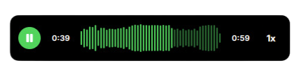
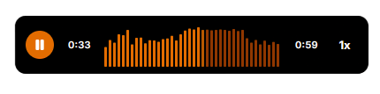
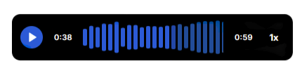

<div align="center">

<!-- Logos stacked vertically -->


<br />

<br />


</div>


<br />

<div align="center">
  <h1 align="center"> React Music Waveform</h3>
  <p align="center">
An open-source React + TypeScript library for customizable audio waveform visualizations.
    <br /><br/>

  </p>

[](https://www.npmjs.com/package/react-music-waveform) &nbsp;
[](https://github.com/Swalih-18/react-music-waveform) &nbsp;
</div>


---

## About The Project

A lightweight, developer-friendly React component for rendering real-time audio waveform visualizations with customizable themes and playback options.

**Features:**

-  4 Built-in Styles: Choose from Viridara (green), Solmara (tangerine), Aurevia (blue), or Minimal (B&W)
-  Light & Dark Themes: Seamless theme switching support
-  Full Audio Controls: Play/pause, speed control, and progress tracking
-  Lightweight: Minimal bundle size with maximum performance
-  TypeScript Ready: Full TypeScript support with comprehensive type definitions
-  Highly Customizable: Extensive props for colors, dimensions, and behavior
-  Responsive: Works perfectly on all device sizes
-  Easy Integration: Drop-in component for any React project

Inspired by modern waveform UI designs and optimized for quick implementation.

---

##Built With

* [![React][React.js]][React-url]
* [![Typescript][Typescript]][Ts-url]
* [![Tailwind][Tailwind]][Tailwind-url]

---

##Getting Started

```bash
npm install react-music-waveform
```

```jsx
import { AudioWaveform } from "react-music-waveform";

const MyMusicPlayer = () => {
  return (
    <AudioWaveform
      src="/path/to/your/audio.mp3"
      style="viridara"
      theme="light"
      height={60}
      showControls={true}
      showTimestamp={true}
      showSpeedControl={true}
    />
  );
};
```

##Props Reference
```typescript
interface AudioWaveformProps {
  src: string;                    // Audio file URL (required)
  style?: WaveformStyle;          // 'viridara' | 'solmara' | 'aurevia' | 'minimal'
  theme?: Theme;                  // 'light' | 'dark'
  height?: number;                // Component height in pixels
  width?: number;                 // Component width in pixels
  barSpacing?: number;            // Space between waveform bars
  primaryColor?: string;          // Custom primary color override
  progressColor?: string;         // Custom progress color override
  backgroundColor?: string;       // Custom background color override
  showBackground?: boolean;       // Show/hide background
  showControls?: boolean;         // Show/hide play/pause controls
  showTimestamp?: boolean;        // Show/hide time display
  showSpeedControl?: boolean;     // Show/hide playback speed control
  className?: string;             // Additional CSS classes
}
```

##Available Styles

**react-music-waveform** comes with 4 beautiful pre-designed styles:

| Style | Description |
|-------|-------------|
| `viridara` | Greenish theme | 
| `solmara` | Vibrant tangerine theme |
| `aurevia` | Cool blue theme | 
| `minimal` | Standard monochrome design |

Each style supports both `light` and `dark` theme variants.


### Default Values

| Property | Default Value |
|----------|---------------|
| `style` | `'minimal'` |
| `theme` | `'light'` |
| `height` | `60` |
| `width` | `300` |
| `barSpacing` | `2` |
| `showBackground` | `true` |
| `showControls` | `true` |
| `showTimestamp` | `true` |
| `showSpeedControl` | `false` |

## Examples

### Basic Usage

```jsx
import { AudioWaveform } from "react-music-waveform";

function BasicPlayer() {
  return (
    <AudioWaveform
      src="/audio/song.mp3"
      style="viridara"
      theme="light"
    />
  );
}
```

### Customized Player

```jsx
import { AudioWaveform } from "react-music-waveform";

function CustomPlayer() {
  return (
    <AudioWaveform
      src="/audio/podcast.mp3"
      style="aurevia"
      theme="dark"
      height={80}
      width={500}
      showControls={true}
      showTimestamp={true}
      showSpeedControl={true}
      primaryColor="#ff6b6b"
      progressColor="#4ecdc4"
    />
  );
}
```

### Minimal Configuration

```jsx
import { AudioWaveform } from "react-music-waveform";

function MinimalPlayer() {
  return (
    <AudioWaveform
      src="/audio/ambient.mp3"
      style="minimal"
      showControls={false}
      showTimestamp={false}
      showBackground={false}
    />
  );
}
```


<!-- MARKDOWN LINKS & IMAGES -->
<!-- https://www.markdownguide.org/basic-syntax/#reference-style-links -->

[license-shield]: https://img.shields.io/github/license/othneildrew/Best-README-Template.svg?style=for-the-badge
[license-url]: https://github.com/othneildrew/Best-README-Template/blob/master/LICENSE.txt
[product-screenshot]: images/screenshot.png
[Typescript]: https://img.shields.io/badge/TypeScript-007ACC?style=for-the-badge&logo=typescript&logoColor=white
[Ts-url]: https://www.typescriptlang.org/
[React.js]:  https://img.shields.io/badge/React-20232A?style=for-the-badge&logo=react&logoColor=61DAFB
[React-url]: https://reactjs.org/
[Tailwind]: https://img.shields.io/badge/Tailwind_CSS-38B2AC?style=for-the-badge&logo=tailwind-css&logoColor=white
[Tailwind-url]: https://tailwindcss.com/